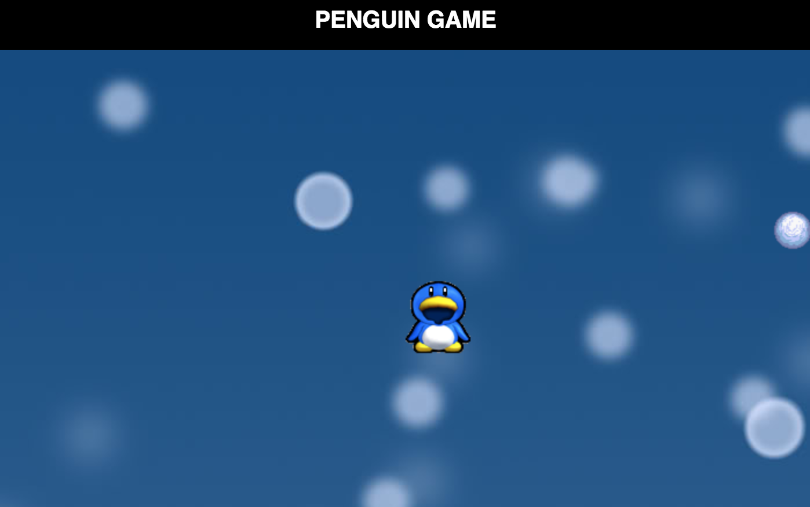

### Penguin Game
During Week 2 of Phase 3 at DevBootcamp, students were asked to create a __Thunder Project__. Students were required to study a new technology and later present it to the class. This thunder project focused on utilizing _Canvas_ and _Javascript_. 

##### How it Worked
* Control penguin using arrow keys 
* Direct penguin towards the snowball
* Everytime the penguin touched a snowball, a new snowball would appear in a random spot on the page

##### Screenshot


##### Technologies
```
* HTML5
* CSS3
* Javascript
```
